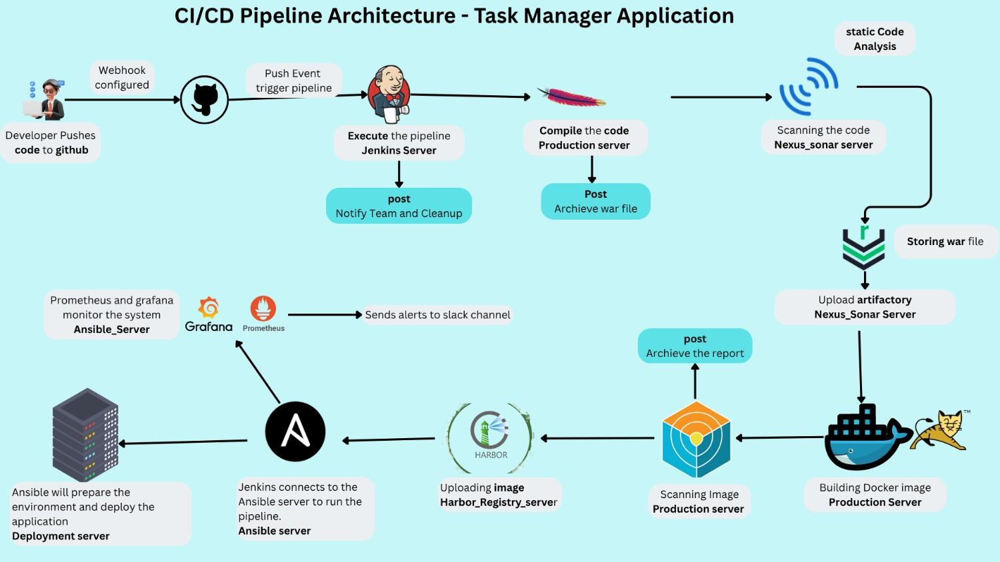
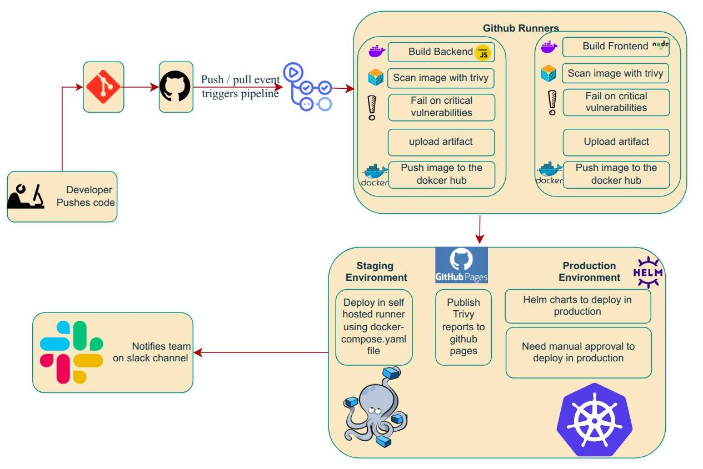
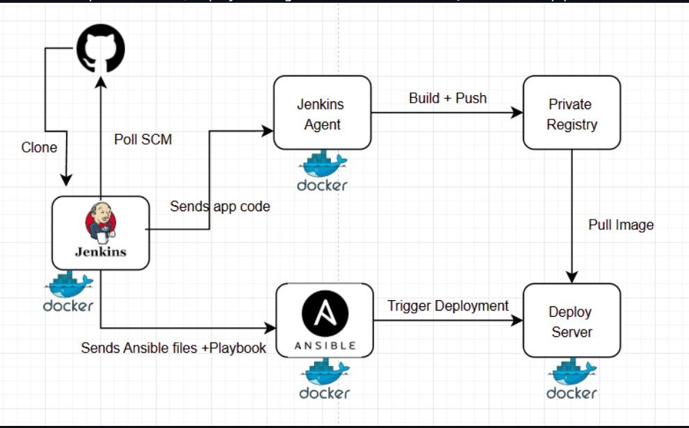
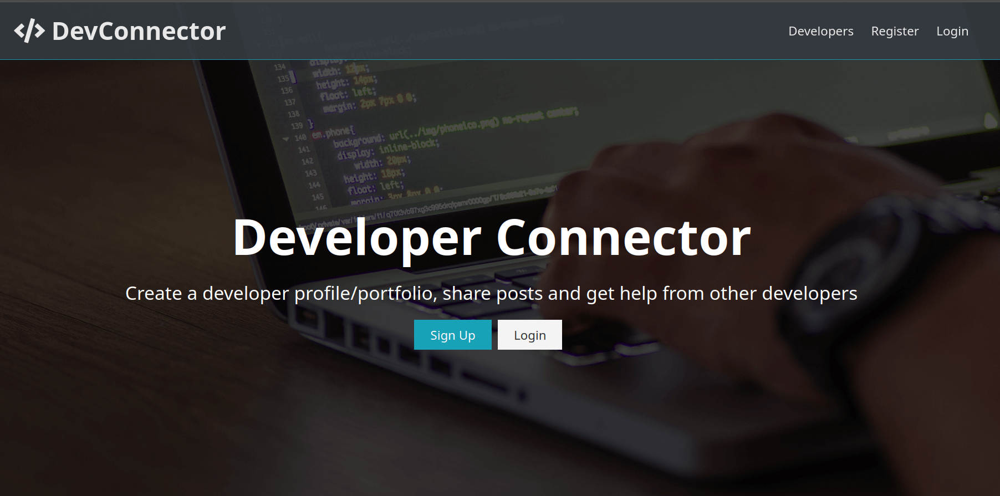

<div align="center">
  <h1>Hi there, I'm Deependra Bhatta 👋</h1>
  
  
  
  <br/>
  
  [](https://www.linkedin.com/in/deependra-bhatta-15a1ba203/)
  [](mailto:bhattadeependra05@gmail.com)
  [](https://www.deependrabhatta.com.np)
  
</div>

---

## 🚀 About Me

```yaml
name: Deependra Bhatta
role: Mid-Level DevOps Engineer
location: Kirtipur, Nepal
focus:
  - Production Infrastructure & Cloud Architecture (AWS)
  - CI/CD Pipeline Design & Automation
  - Infrastructure as Code (Terraform, AWS CDK)
  - Container Orchestration (Docker & Kubernetes)
  - Database Automation & Backup Engineering
  - DevSecOps & Security Hardening
philosophy: "If it can be automated, it should be automated."
current_status: "Deploying production sites & building scalable infra ⚡"
```

<details>
<summary>📊 <b>More About My Journey</b></summary>
<br/>

- 🔭 **Currently:** Deploying & managing production websites and cloud infrastructure
- ☁️ **Cloud:** Designing and operating AWS-based architectures (EC2, S3, CloudFront, Lambda, WAF, CDK)
- 🔐 **Security:** Implementing WAF rules, encrypted backups, and secrets management
- 🤖 **Automation:** Building scripts for DB backups, S3 storage with encryption & integrity checks
- 🎯 **Goal:** Architect highly available, cost-optimized cloud-native solutions
- ⚡ **Fun fact:** I automate my own workflows before automating others!

</details>

---

## 🌐 Production Sites — Live & Deployed

> Real-world websites I've architected, deployed, and currently manage in production.

<div align="center">

| # | Site | Stack | Status |
|:-:|------|-------|:------:|
| 1 | [**sbrsuccess.com.au**](https://sbrsuccess.com.au) | AWS CDK · CloudFront · Lambda · WAF · MongoDB |  |
| 2 | [**devpulse.info**](https://devpulse.info) | AWS · CloudFront · S3 · CI/CD |  |
| 3 | [**sanatanjyotish.com**](https://sanatanjyotish.com) | AWS · CloudFront · Route53 · SSL |  |
<!-- ADD NEW SITES HERE — copy a row above, increment #, and fill in details -->

</div>

---

## 🛠️ Tech Arsenal

<div align="center">

### ☁️ Cloud & Infrastructure


### 💻 CI/CD & Automation


### 📦 Containers & Orchestration


### 🔍 Observability & Security


### 🗄️ Databases


<!-- ADD NEW BADGES HERE — use the format:  -->

</div>

---

## ⚙️ Automation & Scripts

> Production-grade automation scripts I've built and operate in real environments.

<table>
<tr>
<td width="50%" valign="top">

### 🗃️ Automated DB Backup Pipeline
**Database → Encrypt → S3**

Hands-off automated backup system for production databases with enterprise-grade security.

**What it does:**
- ✅ Scheduled automated database dumps (MongoDB / PostgreSQL / MySQL)
- ✅ AES-256 encryption at rest before upload
- ✅ SHA-256 checksum (shasum) generation for integrity verification
- ✅ Automated upload to S3 with versioning & lifecycle policies
- ✅ Slack/email notifications on success or failure

**🔧 Built with:** Bash · AWS CLI · OpenSSL · Cron · S3

</td>
<td width="50%" valign="top">

### 🔄 CI/CD Pipelines
**Push → Build → Test → Deploy**

End-to-end deployment pipelines powering the production sites listed above.

**What they do:**
- ✅ Multi-environment pipelines (dev → staging → prod)
- ✅ Automated testing, linting, and security scans
- ✅ Infrastructure deployments via AWS CDK / Terraform
- ✅ Zero-downtime deployments with CloudFront invalidation
- ✅ Branch-based trigger strategies (main, dev, feature)

**🔧 Built with:** GitHub Actions · AWS CDK · Docker · Node.js

</td>
</tr>
<!-- ADD NEW AUTOMATION PROJECTS HERE — copy a <tr>...</tr> block above -->
</table>

---

## 🏗️ Featured Projects

<table>
<tr>
<td width="50%" valign="top">

### 🎯 Task Manager (Java)
**End-to-End CI/CD Pipeline**

<a href="https://github.com/dipen674/Simple_Java_TM/tree/harbor">
  
</a>

Automated deployment on VMs using Jenkins orchestration, Harbor registry, and Ansible configuration.

**🔧 Tech Stack:**
- Jenkins • Ansible • Harbor
- Prometheus • Grafana • SonarQube

**✨ Key Features:**
- ✅ Mandatory SonarQube & Trivy Scans
- ✅ Prometheus & Grafana Alerts
- ✅ Zero-touch deployment

<div align="center">
  
  [](https://github.com/dipen674/Simple_Java_TM/tree/harbor)
  
</div>

</td>
<td width="50%" valign="top">

### 🏢 IDURAR ERP (MERN)
**K8s Orchestration & GitOps**

<a href="https://github.com/dipen674/mern_admin_nodejs_fullstack">
  
</a>

Production-grade MERN deployment on Kubernetes using Helm charts and GitHub Actions.

**🔧 Tech Stack:**
- Kubernetes • Helm • Docker
- GitHub Actions • Trivy • Slack

**✨ Key Features:**
- ✅ Helm Chart Management
- ✅ PVC for Data Persistence
- ✅ Ingress Controller Setup

<div align="center">
  
  [](https://github.com/dipen674/mern_admin_nodejs_fullstack)
  
</div>

</td>
</tr>

<tr>
<td width="50%" valign="top">

### 🔐 MERN Task Manager
**Secure Artifact Registry**

<a href="https://github.com/dipen674/Ansible_Project/tree/main">
  
</a>

Build-to-deploy automation focusing on secure image storage in a private Harbor registry.

**🔧 Tech Stack:**
- Docker • Jenkins • Ansible
- Harbor • Trivy • Node.js

**✨ Key Features:**
- ✅ Automated Image Hardening
- ✅ Private Harbor Integration
- ✅ Env Variable Management

<div align="center">
  
  [](https://github.com/dipen674/Ansible_Project/tree/main)
  
</div>

</td>
<td width="50%" valign="top">

### 🌐 DevConnector
**Micro-Container Architecture**

<a href="https://github.com/dipen674/Django_React_application">
  
</a>

Multi-container Django & React app orchestrated with Nginx as a reverse proxy.

**🔧 Tech Stack:**
- Docker Compose • Django
- React • Nginx • PostgreSQL

**✨ Key Features:**
- ✅ Nginx Reverse Proxy Config
- ✅ Docker Compose Networking
- ✅ DB Migration Automation

<div align="center">
  
  [](https://github.com/dipen674/Django_React_application)
  
</div>

</td>
</tr>
<!-- ADD NEW PROJECTS HERE — copy a <tr>...</tr> block above -->
</table>

<div align="center">

### 🔍 Want to see more?

[](https://github.com/dipen674?tab=repositories)

</div>

---

## 📊 GitHub Analytics

<div align="center">
  
  
</div>

<div align="center">
  
</div>

---

## 💼 Professional Experience & Growth

<details>
<summary><b>📈 Click to expand my career timeline</b></summary>
<br/>

### 🟢 Mid-Level DevOps Engineer — *Present*
- 🌐 Deployed & managing **3+ production websites** serving real users
- ☁️ Designing AWS cloud architectures (CDK, CloudFront, Lambda, WAF, S3)
- 🤖 Built automated DB backup pipelines with encryption & integrity verification
- 🔄 Created multi-environment CI/CD pipelines (GitHub Actions)
- 🔐 Implemented WAF rules, secrets management, and security hardening
- � Conducted production database audits (PostgreSQL, MySQL, MongoDB)

### 🔵 Junior DevOps Engineer — *Earlier*
- �🚀 Built 4+ end-to-end DevOps projects with CI/CD pipelines
- ☸️ Deployed applications on Kubernetes using Helm
- 🔒 Implemented security scanning with Trivy & SonarQube
- 📊 Set up monitoring with Prometheus & Grafana
- 🏠 Ran a home lab to practice production scenarios

<!-- ADD NEW CAREER MILESTONES HERE -->

</details>

---

## 🎓 Certifications & Learning

<div align="center">

[]()
[]()
[]()

<!-- ADD NEW CERTIFICATION BADGES HERE -->

*Preparing for CKA and AWS Solutions Architect certifications*

</div>

---

## 🤝 Let's Connect!

<div align="center">

**I build production infrastructure, automate operations, and ship reliable systems.**

[](https://www.linkedin.com/in/deependra-bhatta-15a1ba203/)
[](https://www.instagram.com/dipendrabhatta21/)
[](https://www.facebook.com/dipendra.bhatta.244268/)
[](https://discord.com/users/deependrabhatta)
[](mailto:bhattadeependra05@gmail.com)

*Open to collaboration, consulting, and DevOps opportunities!*

</div>

---

<div align="center">

### 💭 Random Dev Quote


### 👁️ Profile Views


---

<sub>⭐️ From [Deependra Bhatta](https://github.com/dipen674) with ❤️</sub>

<sub>💡 **Pro tip:** Star this profile if you found it helpful!</sub>

</div>
